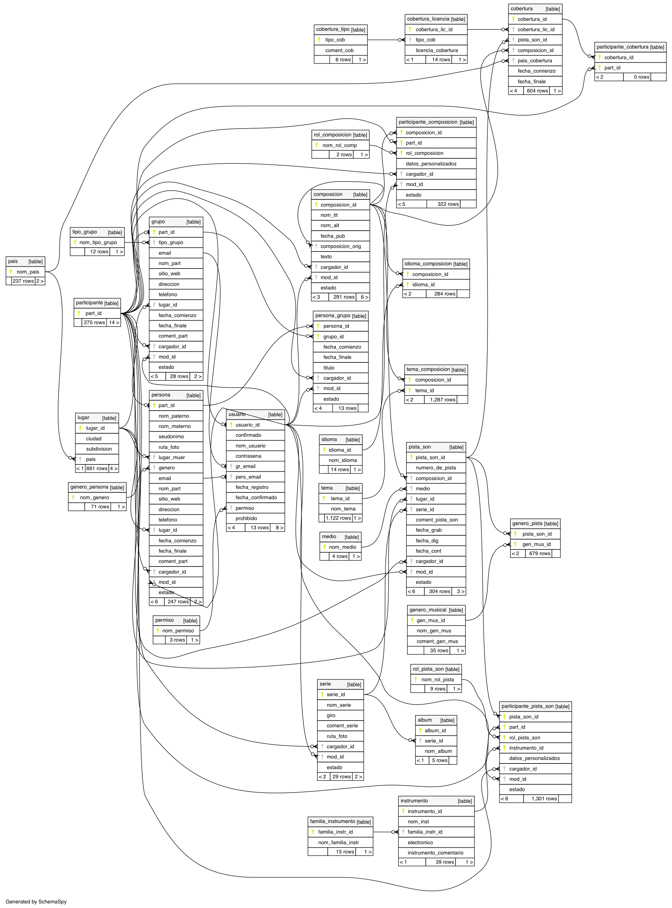
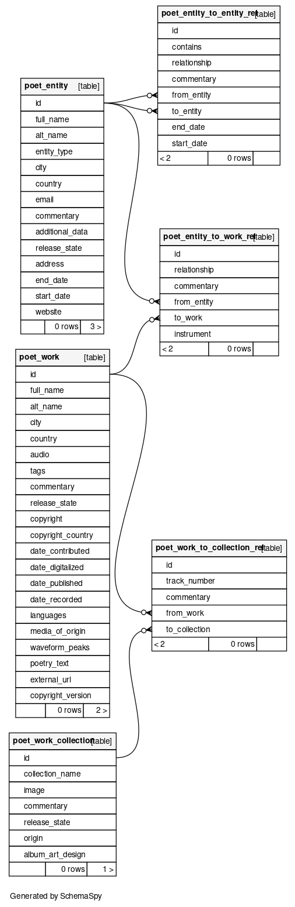

# Design

The design of [Poética Sonora][sonora] has evolved over the course of its life from
a heavily [normalized schema][normalization], to a more denormalized schema.
[Full-text search][search] is performed by [Postgres][db-search] as opposed to using a
dedicated text-search engine - such as [Elasticsearch][es] - which would substantially
increase the complexity of the project. The migration from normalized to denormalized
improves the searchability of the database.

Old normalized schema:

With the normalized database it was found that data covering each entity formed largely sparse tables.
These numerous columns hindered both searchability and maintability. By denormalizing the data
we required less text-search indices.

By taking advantage of [Postgres' JSON capabilities][pg-json] users can upload arbitrary
data about each entity, which can be desirable in an archive situation where the goal
is to preserve as much information as possible. Simultaneously this removes the overhead
of having to maintain dozens of columns which are only used by one or two rows in the
database.

New Schema:

[sonora]: https://poeticasonora.unam.mx/rda
[normalization]: https://en.wikipedia.org/wiki/Database_normalization
[search]: https://en.wikipedia.org/wiki/Full-text_search
[db-search]: https://www.postgresql.org/docs/current/textsearch.html
[pg]: https://www.postgresql.org/
[es]: https://www.elastic.co/elasticsearch/
[pg-json]: https://www.postgresql.org/docs/current/functions-json.html
